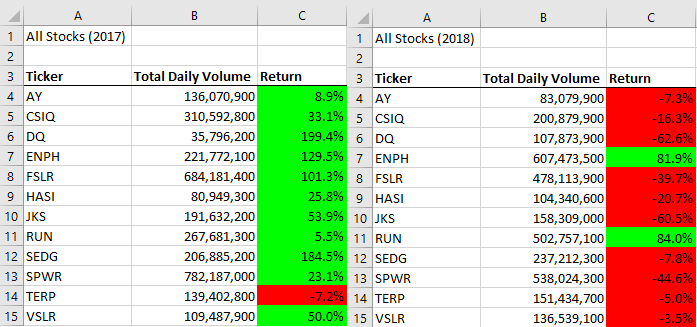
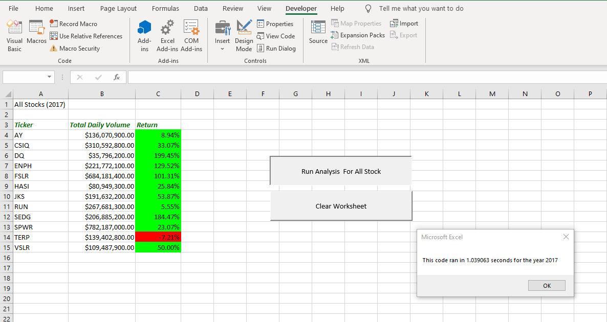
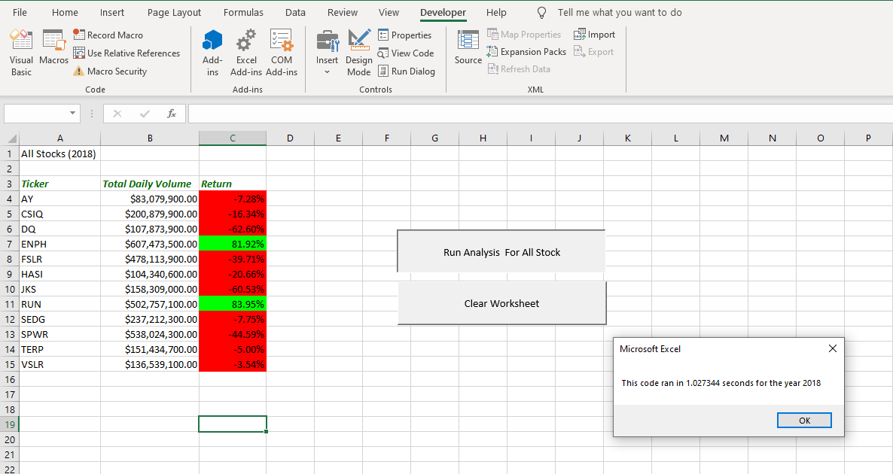
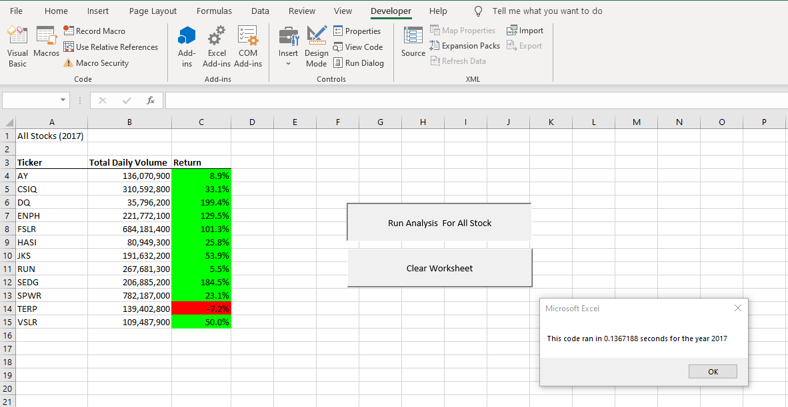
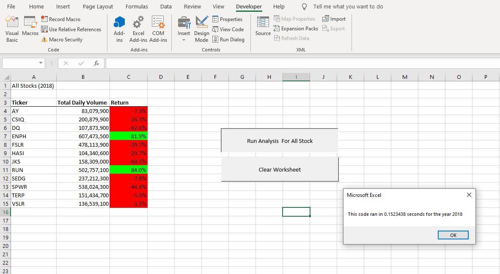

# Stock Analysis with VBA

## Overview of Project

The purpose of this project was to analyze a set of [stocks from the years 2017 and 2018](VBA_Challenge.xlsm) to show the *total daily volume* and *return percentage* from each stock. This was accomplished by using VBA to write modules with nested loops that would cycle through the stocks excel and match stock tickers to starting and ending prices for the stock, as well as calculating the sum of the total daily volumes. After formatting the resulting table and adding a timer to the module to test its execution time, the module was refactored in the hopes of increasing the module execution time. This refactor changed the code of the module so that a single loop would cycle through the excel sheets and gather all of the data rather than nested loops cycling through the sheets multiple times.

## Results

### Stock Performance Comparison

When comparing the stock performance from 2017 to 2018, it can be shown that there was a drastic difference between the two years.  In 2017, all but one stock showed a positive return, with four stocks showing return percentages over 100%. However, in 2018 only two stocks showed positive returns, neither of which were over 100%. There does not seem to be any correlation between changing *Total Daily Volumes* and changes in *Return Percentages*. Three stocks, *ENPH*, *RUN*, and *TERP* showed some consistency in *Returns* from one year to the next, so with the available data, it can be concluded that *ENPH* and *RUN* are safer stocks to invest in, and *TERP* is a consistently unsafe investment.

### Script Execution Time Comparison

There was a significant reduction in the execution time of the refactored script vs the original script. As can be seen here, the execution times for the original script were both approximately 1 second:  
However, the execution times for the refactored scripts both approximately 0.1 second, nearly a full second faster than the original.  
This refactor was accomplished by creating an array for each variable being measured and using a *ticker index* to match the array outputs to the correct ticker. By doing so, the refactored module is able to run a single *for loop* to cycle through the stock data once, as shown here:
```
For i = 2 To RowCount
        '3a) Increase volume for current ticker
        tickerVolumes(tickerIndex) = tickerVolumes(tickerIndex) + Cells(i, 8).Value
       
        '3b) Check if the current row is the first row with the selected tickerIndex.
            If Cells(i - 1, 1).Value <> tickers(tickerIndex) And Cells(i, 1) = tickers(tickerIndex) Then
                tickerStartingPrices(tickerIndex) = Cells(i, 6).Value
            End If
        
        '3c) check if the current row is the last row with the selected ticker
         'If the next row’s ticker doesn’t match, increase the tickerIndex.
            If Cells(i + 1, 1).Value <> tickers(tickerIndex) And Cells(i, 1) = tickers(tickerIndex) Then
                tickerEndingPrices(tickerIndex) = Cells(i, 6).Value
            End If
            
            '3d Increase the tickerIndex.
            If Cells(i + 1, 1).Value <> tickers(tickerIndex) Then
                tickerIndex = tickerIndex + 1
            End If
    Next i    
```
On the other hand, the original script only had an array for the tickers, and instead relied on nested *for loops* to sort the outputs of the module.

```
    For i = 0 To 11
            ticker = tickers(i)
            totalVolume = 0
            'Loop through rows in the data
            Worksheets(yearValue).Activate
               
        For j = 2 To RowCount
                
            'Find total volume for the current ticker
                If Cells(j, 1).Value = ticker Then
                    totalVolume = totalVolume + Cells(j, 8).Value
                End If
            
            'Find starting price for the current ticker
                If Cells(j - 1, 1).Value <> ticker And Cells(j, 1).Value = ticker Then
                    startingPrice = Cells(j, 6).Value
                End If
          
            'Find ending Price for the current ticker
                If Cells(j, 1).Value = ticker And Cells(j + 1, 1).Value <> ticker Then
                    endingPrice = Cells(j, 6).Value
                End If
         Next j
    
    'Output the data for the current ticker
        Worksheets("All Stocks Analysis").Activate
        Cells(4 + i, 1).Value = ticker
        Cells(4 + i, 2).Value = totalVolume
        Cells(4 + i, 3).Value = (endingPrice / startingPrice) - 1
        
    Next i
```
This caused the module to run through the data multiple times as it examined the data through the scope of the nested *for loops* for every sequence of the original loop. 

## Summary

### Advantages/Disadvantages of Refactoring Code

Refactoring code is advantageous because it allows you to keep the function of the original code while adapting the code to your current needs. This can allow programs to run faster by simplifying the script and eliminating redundancy. Refactoring also allows you to adapt existing code to new circumstances. For instance, if a program that typically processes smaller data sets is required to process large data sets, the original code that worked effectively previously might become inefficient. Therefore, the code must be refactored to efficiently process large data sets. The disadvantage of refactoring code is that it is time consuming, may introduce bugs, and could lead the program down a path that inhibits future growth. Refactoring code requires time and effort to develop new code, and there is no guarantee that a given refactor will result in a working script or that the new script will run more efficiently. This trial-and-error approach can consume much of a coder’s time before producing results. Meanwhile, refactoring the code might cause errors in the code that aren’t discovered during testing, resulting in “bugs” in the program. Finally, as programs are constantly being asked to adapt to new circumstance, a particular refactor of a code might lead that code down a path where it cannot adapt to a future circumstance, leading to the need for the code to be completely redesigned from a previous stage.

### Advantages/Disadvantages of Refactoring the VBA Code

With regards to the VBA code for the stock analysis that was refactored, the clearest advantage is the remarkable increase in execution time for the script. However, a less obvious advantage to this refactor is that it gives the code room for growth. If there is ever a need to examine larger data sets for stocks in the future, the refactored code will continue to run relatively fast, while the addition of new stocks would drastically increase the execution time of the original script due to the use of nested *for loops*.  The disadvantage of refactoring the VBA code is that was time consuming, and was more complex, requiring the creation of new variables, in this case the three output arrays, to function correctly. 


